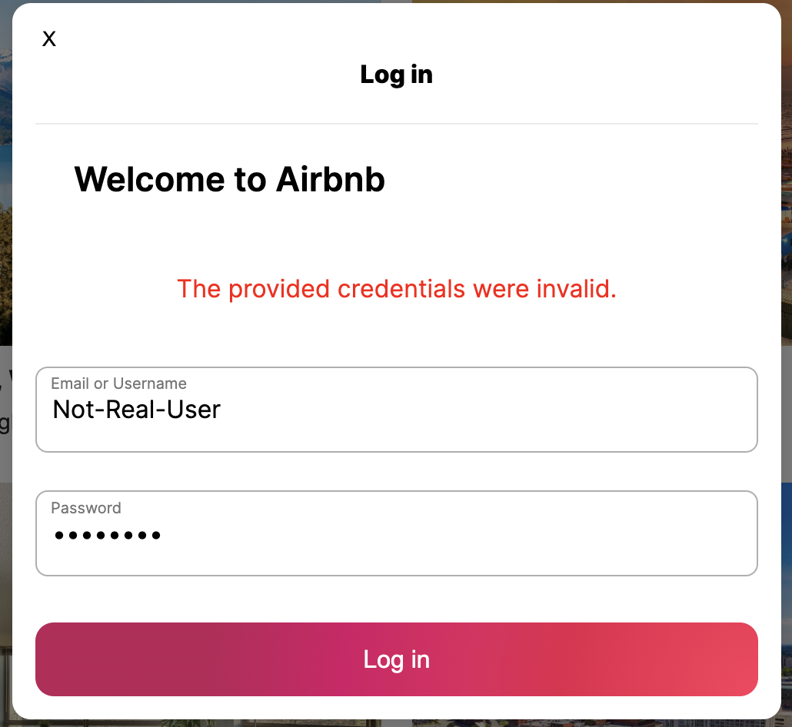
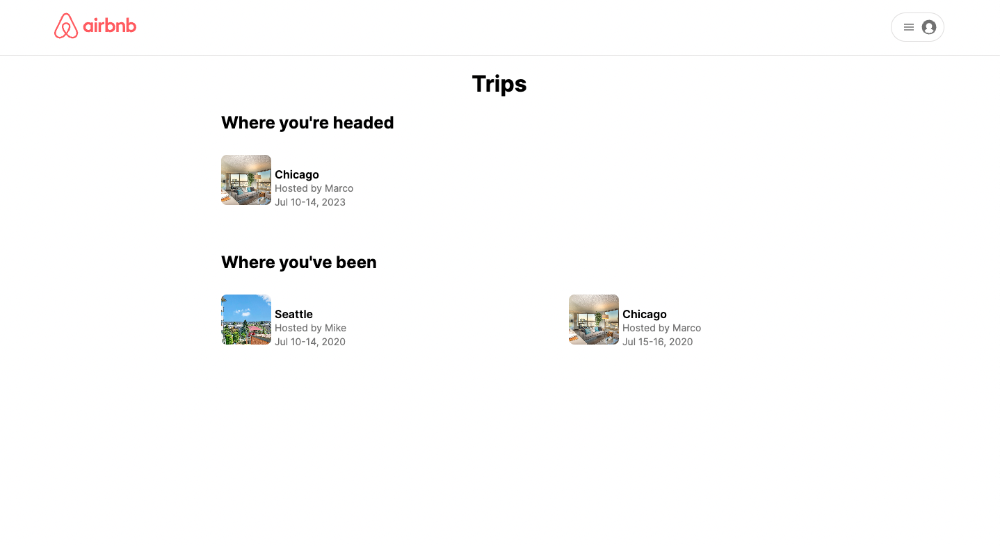
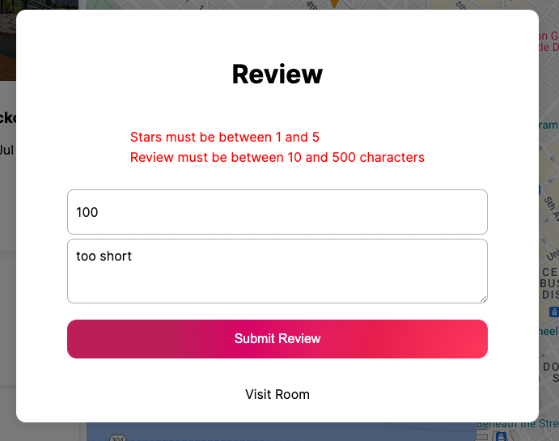
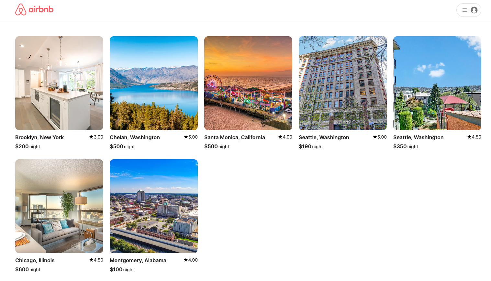

# Airbnb Clone

## Deployed Application: [Heroku](https://airbnb-clone-fullstack.herokuapp.com/)

## Description

This project is a clone of Airbnb. Features include; user authentication, hosting a room, creating a booking, and leaving reviews for places you have stayed at. 

Images are hosted with Amazon Web Services and maps are from the Google Maps API.

# Wiki Links

## [Feature List](https://github.com/yonilurie/backend-project-airbnb/wiki/Features-List)

## [API Docs](https://github.com/yonilurie/backend-project-airbnb/wiki/Backend-API)

## [Redux State Shape](https://github.com/yonilurie/backend-project-airbnb/wiki/Redux-State-Shape)

## [Database Schema](https://github.com/yonilurie/backend-project-airbnb/wiki/Database-Schema)

# Created with

  

  

  

 

# Features

## User Authentication

 

## Users may login using the demo link in the profile button

## Users may also login to an existing account

If the credentials are invalid an error message will show so the user knows they provided the wrong credentials

## Or signup for a new account

The user can signup and will be propmpted with any errors about their form
and will not be able to submit until they are corrected

## Once the user is logged in the contents of the profile button will change

The user can now

-   View their bookings through <b>Trips</b>
-   Create a room through <b>Host your Home</b>
-   View their existing rooms through <b>My Rooms</b>
-   And logout through <b>Log Out</b>

## My Trips

Here the user can see their past bookings under <b>Where you've been</b>
and their future bookings under <b>Where you're headed</b>

Clicking on any of the bookings will take the user to the bookings information page

Under the users past bookings theire are buttons to leave or edit a review whcih dynamically change based on whether or not a user has left a review

## Submit review 

## Home Page

## Create a booking

