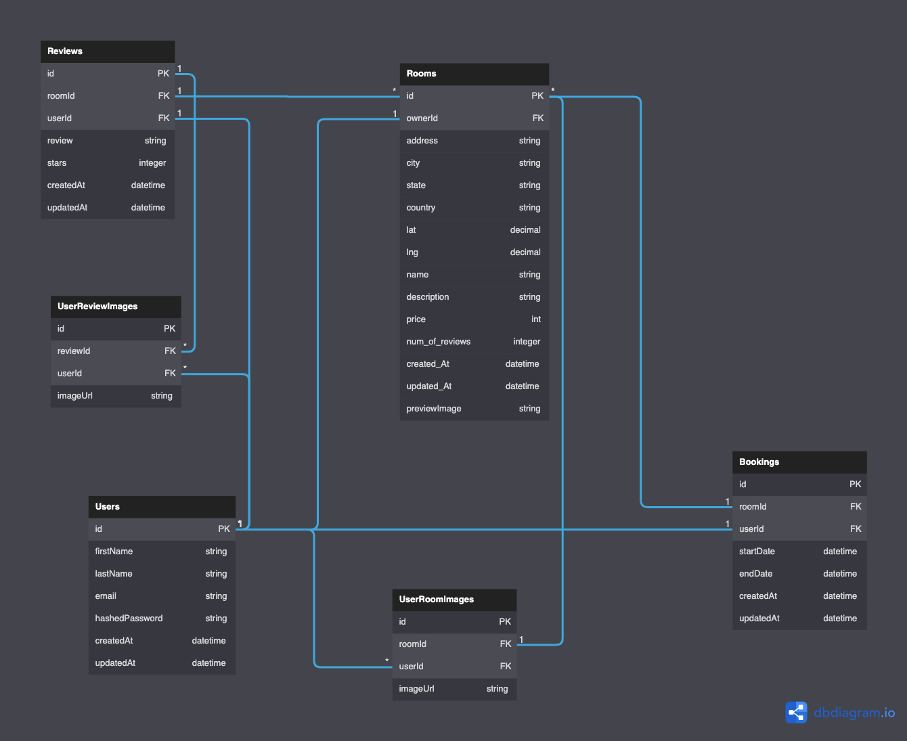

# Airbnb Clone

## Deployed Application:

Heroku: https://backend-project-airbnb.herokuapp.com/

## Description

This project is a clone of Airbnb.
After logging in, a user can create a room for others to book.
A user may also book someone elses room, or write a review for it.

## API Documentation

[Link to API Docs README.md](./backend/README.md)

## Database Schema Design:



# Redux State Shape:

```js
store = {
    currentRoom {
        Owner: { id, firstName, lastName},
        Reviews: {
            [reviewId]: {
                User: { id, firstName, lastName},
                ...Review info
            }
         images: [...Room images]
        ...Room info
        }
    }
    rooms: {
        ...All rooms indexed by roomId

       [roomId]: {
           ...Room Info
       }
    }
    session: {
        bookings: {
            [bookingId]: {...Users bookings info}
        },
        reviews: {
            [reviewId]: {...Users reviews info}
        },
        rooms: {
            ...Users owned rooms info
        }
        user: {
            id, firstName, lastName, email, username
        }
    },
}
```

# Features List:

1. Rooms
2. Reviews
 <!-- 3. Bookings
3. Favorites -->
