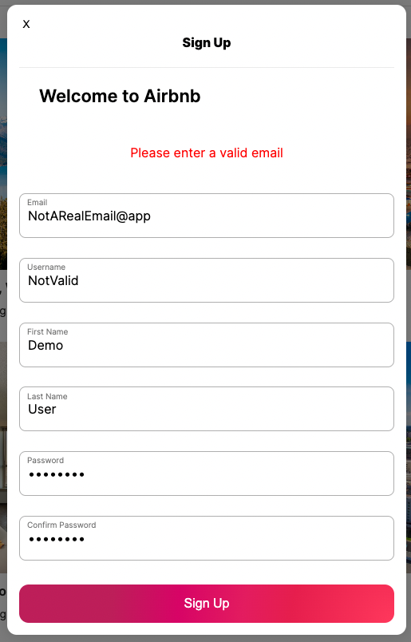
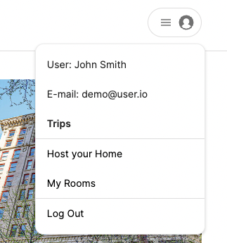

# Airbnb Clone

## Deployed Application:

Heroku: https://backend-project-airbnb.herokuapp.com/

## Description

This project is a clone of Airbnb. Users can host their own rooms, as well as view other users hosted rooms.
Users can also see the reviews other people have left on their possible vacation spots, and leave their own reviews on rooms they have previously stayed at.

In the future, the ability to create bookings and upload images for reviews and rooms will be implemented

# Wiki Links

## [Feature List](https://github.com/yonilurie/backend-project-airbnb/wiki/Features-List)

## [API Docs](https://github.com/yonilurie/backend-project-airbnb/wiki/Backend-API)

## [Redux State Shape](https://github.com/yonilurie/backend-project-airbnb/wiki/Redux-State-Shape)

## [Database Schema](https://github.com/yonilurie/backend-project-airbnb/wiki/Database-Schema)

# Created with

## JavaScript

## CSS

## HTML

## Node.JS

## React

## Redux

## Express

## SQLITE

## Heroku

 

# Features

## User Authentication

 

## Users may login using the demo link in the profile button

This will automatically log the user into a demo account and will allow them to use the sites features

## Users may also login to an existing account

If the credentials are invalid an error message will show so the user knows they provided the wrong credentials

## Or signup for a new account

The user can signup and will be propmpted with any errors about their form
and will not be able to submit until they are corrected

## Once the user is logged in the contents of the profile button will change

The user can now

-   View their bookings through <b>Trips</b>
-   Create a room through <b>Host your Home</b>
-   View their existing rooms through <b>My Rooms</b>
-   And logout through <b>Log Out</b>

## My Trips @ /trips

Here the user can see their past bookings under <b>Where you've been</b>
and their future bookings under <b>Where you're headed</b>

Clicking on any of the bookings will take the user to the bookings information page

Under the users past bookings theire are buttons to leave or edit a review whcih dynamically change based on whether or not a user has left a review

## Submit review @ /review-room/:roomId

Clicking on the <b>Add review</b> or <b>Edit review</b>button will take the user to /review-room/:roomId

